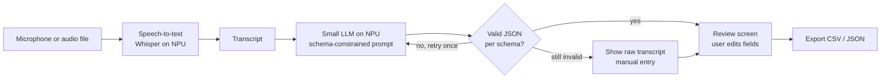

# Architecture

## Pipeline

Everything in this diagram runs on the local machine. There are no network calls.

## Components

| Component | Responsibility |
|---|---|
| Audio capture | Record from the microphone or load a file; convert to the format the ASR model expects |
| ASR | Transcribe audio to text using Whisper via ONNX Runtime (QNN execution provider) |
| Structuring | Prompt the local LLM to fill the schema in `schema/interview_schema.json` |
| Validator | Check LLM output against the schema; retry once; fall back to manual entry |
| Review UI | Show transcript and extracted fields side by side; every field editable |
| Exporter | Write one row per interview to CSV or JSON |

## Design decisions

- **Pre-trained models only.** No training or fine-tuning; the value is in the workflow, schema and offline packaging.
- **Fixed schema.** A small model is more reliable when asked for a narrow, validated structure than for free-form summaries.
- **Verbatim quotes.** The prompt asks for quotes copied from the transcript, and the review screen shows them next to the transcript so the user can check them.
- **Human in the loop.** The tool assists; the user confirms every field before export.
- **Graceful failure.** If the LLM fails, the user still gets the transcript.
- **Offline by design.** Models are downloaded once during setup; after that no connection is needed.

## Not included

Speaker separation, multilingual support, cloud sync, user accounts.
